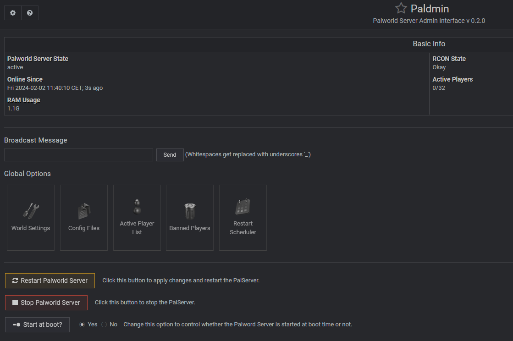

# Paldmin
A [Webmin](https://webmin.com/) module for easy configure and control of a Palworld Server.

This module is still big **Work In Progress**.

### Current Features
* Starting, Stopping, Restarting Server via daemon
* Basic Info
* Edit PalWorldSettings.ini (or any other .ini file)
* Full RCON Support (Kick / Ban Player, Broadcast, List Player, ...)

### Upcoming Features
* Set Schedule Restart
* Set Backup Plan
* Custom RCON command
* Import & Convert savegames

## Installation

Please follow the [installation guide](./docs/install.md)

## Usage

Please follow the [usage guide](./docs/usage.md)

## FAQs

(TBD)

## Thanks

* [A1RM4X](https://github.com/A1RM4X) - For the initial tutorial of the linux palword server
