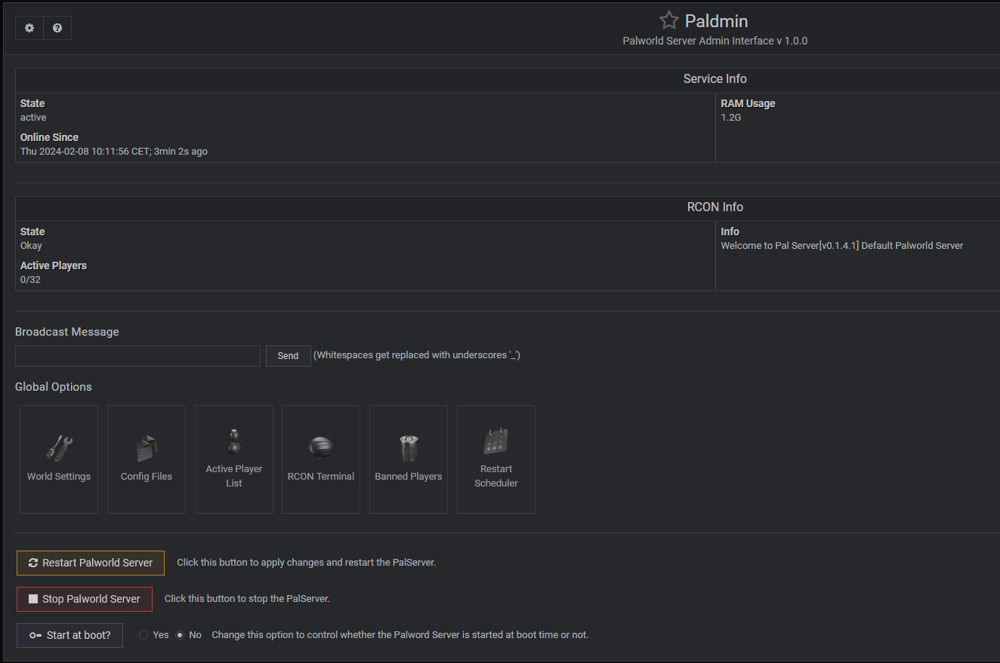

# Paldmin
A [Webmin](https://webmin.com/) module for easy configure and control of a Palworld Server.

This module is still big **Work In Progress**.

### Current Features
* Starting, Stopping, Restarting Server via daemon
* Basic Info
* Edit PalWorldSettings.ini (or any other .ini file)

### Upcoming Features
* Set Schedule Restart
* Set Backup Plan
* Connect RCON / Base Commands
	* Broadcast
	* Playerlist
	* Kick / Ban Player
	* ...
* RCON Specific commands
* Import & Convert savegames

## Installation

This module was developed using Debian 12 (bookworm). Please note that other OS may not work as expected (open an issue).

1. Get a Debian Server
2. Install [Webmin](https://www.howtoforge.com/how-to-install-webmin-on-debian-12/)
3. Follow **strictly** [this](https://github.com/A1RM4X/HowTo-Palworld/tree/main) tutorial to install Palworld Server on Linux
4. Install the Module
	- Go to [releases](https://github.com/riffy/paldmin/releases) and copy the release link (`release.tar.gz`)
	- Go to your webmin: `Webmin -> Webmin Configuration -> Webmin Modules -> Install` and choose `From HTTP or FTP URL`
	- Paste the link and click `Install Module`

You should now see `Palworld Admin` under the `Servers` category.

**Note**: If you installed a firewall, add the Palworld Server Port to the allowed list

## Usage

This module is heavily based on the tutorial provided by **A1RM4X** and assumes that a daemon `palworld.service` exists, but the [Module Configuration](#moduleconfig) allows to control or fine tune the environment.

### Module Configuration

The module configuration can be accessed by clicking the gear ⚙ in the top left corner on the Paldmin Module page.
If you chose a different installation path or your environment changes, you can make edits here.

| Module Config | Description | Default Value |
| ------------- | ------------- | ------------- |
| PalServer Directory  | Full path to the installed PalServer directory |  /home/steam/.local/share/Steam/steamapps/common/PalServer  |
| Paldmin config file | Webmin Config file for later use | /etc/paldmin.conf |
| Daemon Service | The daemon service which is controlled by the module via `start`, `stop`, `restart` | palworld.service |

### World Settings

The World Settings page reads the `$SERVER_DIR/Config/LinuxServer/PalWorldSettings.ini` file and displays it in a manner for easier configuration.
It starts by reading the `DefaultPalWorldSettings.ini` and replacing all existing values with values from the `PalWorldSettings.ini`, if there are any.

If you want to add a new field to settings, just update the `DefaultPalWorldSettings.ini` in the server directory manually.

Please note the following information about syntax when editing the World Settings:
* NEVER use commas (,) or equalsigns (=) ANYWHERE. (no, not even in the server name)
* Always use point (.) for decimals.
* Use double quotes "" when they are already present (e.g. for text inputs).

## FAQs

(TBD)

## Thanks

* [A1RM4X](https://github.com/A1RM4X) - For the initial tutorial of the linux palword server
