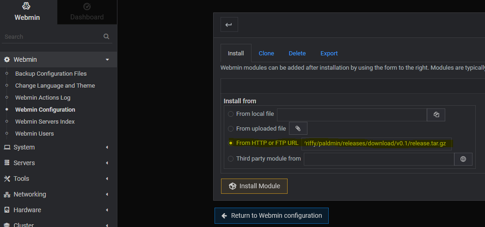

# Installation

> [!IMPORTANT]
> This module was developed using Debian 12 (bookworm). Please note that other OS may not work as expected. In this case, open an issue and provide information about the used environment.

## Basic Installation
1. Get a Debian Server
2. Install [Webmin](https://www.howtoforge.com/how-to-install-webmin-on-debian-12/)
3. Follow **strictly** [this](https://github.com/A1RM4X/HowTo-Palworld/tree/main) tutorial to install Palworld Server on Linux
4. Install the Module
	- Go to [releases](https://github.com/riffy/paldmin/releases) and copy the release link (`paldmin-$VERSION.tar.gz`)
	- Go to your webmin: `Webmin -> Webmin Configuration -> Webmin Modules -> Install` and choose `From HTTP or FTP URL`
	- Paste the link and click `Install Module`

You should now see `Palworld Admin` under the `Servers` category.

> [!NOTE]
> If you installed a firewall, add the Palworld Server and Webmin Port to the allowed list.

## RCON

For some functions to work properly, an RCON client is necessary, which the Paldmin will invoke commands on to issue to the server.

For the rcon-cli, we use [this](https://github.com/gorcon/rcon-cli) one from gorcon.

1. Open a SSH Terminal to your server
2. Login as the same user that hosts the Palworld Server, if you followed the linked tutorial this would be `steam` and switch directory to your home `cd ~`.
3. Go to [releases](https://github.com/gorcon/rcon-cli/releases) and download a suitable linux release:
	- `wget https://github.com/gorcon/rcon-cli/releases/download/v0.10.3/rcon-0.10.3-amd64_linux.tar.gz`
	- Unpack tarball `tar -xvf rcon-0.10.3-amd64_linux.tar.gz`
4. Now you should have a directory with an `rcon` executable inside a directory. Enter the directory into your [Module Configuration](#moduleconfig).
5. Please check your [World Settings](./usage.md#world-settings) if `RCON` is enabled and an `AdminPassword` is set. The `RCONPort` doesn't need to be added to the firewall.
6. Alternatively you can set overwrite values for the address and password of the rcon in the module configuration.

## Module Configuration

This module is heavily based on the tutorial provided by **A1RM4X** and assumes that a daemon `palworld.service` exists, but the Module Configuration allows to control or fine tune the environment.

The module configuration can be accessed by clicking the gear ⚙ in the top left corner on the Paldmin Module page.
If you chose a different installation path or your environment changes, you can make edits here.

| Module Config | Description | Default Value |
| ------------- | ------------- | ------------- |
| PalServer Directory  | Full path to the installed PalServer directory |  `$[STEAMDIR]/steamapps/common/PalServer`  |
| Paldmin config file | Webmin Config file for later use | `/etc/paldmin.conf` |
| Daemon Service | The daemon service which is controlled by the module via `start`, `stop`, `restart` | `palworld.service` |
| RCON directory | Path to the directory where the `rcon` executable is located | |
| RCON Address | If set, paldmin will force-enable rcon (ignoring world settings) using this address | `From World Settings`
| RCON Password | If set, paldmin will force-use the value for rcon password (ignoring world settings) | `From World Settings`

