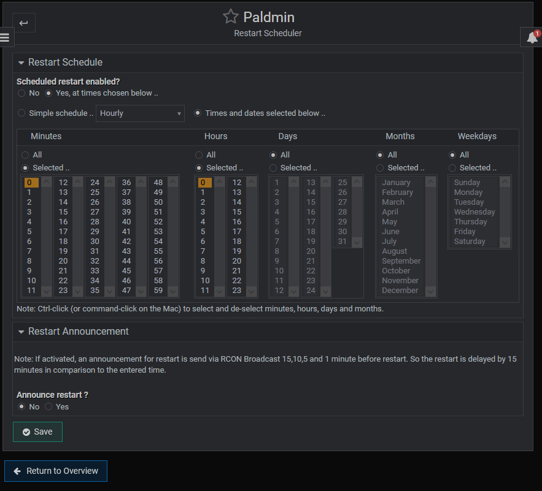
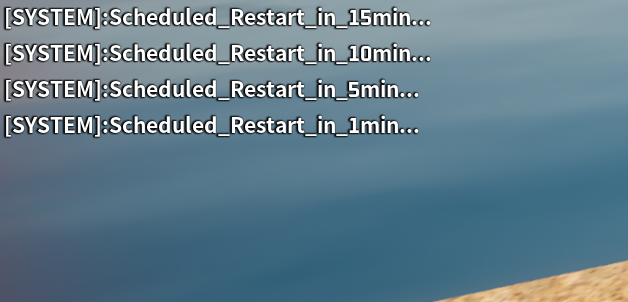

# Usage

> [!NOTE]
> Some features or functionality are only accessible if the server is running AND [RCON](./install.md#rcon) is installed and correctly configured.

## Broadcast Message

> [!NOTE]
> * [RCON](./install.md#rcon) required

Sends a broadcast message to the server in the chat. Whitespaces are automatically replaced with underscores (\_).

## World Settings

The World Settings page reads the `$SERVER_DIR/Config/LinuxServer/PalWorldSettings.ini` file and displays it in a manner for easier configuration.
It starts by reading the `DefaultPalWorldSettings.ini` and replacing all existing values with values from the `PalWorldSettings.ini`, if there are any.

If you want to add new fields to settings, just update the `DefaultPalWorldSettings.ini` in the server directory manually.

> [!IMPORTANT]
> Please note the following information about syntax when editing the World Settings:
> * NEVER use commas (,) or equalsigns (=) ANYWHERE. (no, not even in the server name)
> * Always use point (.) for decimals.
> * Use double quotes "" when they are already present (e.g. for text inputs).

## Config Files

The Config Files page allows for editing of all files that are placed inside `$SERVER_DIR/Config/LinuxServer/` (yes, event `PalWorldSettings.ini`) but with a plain editor.

## Active Player List
> [!NOTE]
> * [RCON](./install.md#rcon) required

Displays all active players on the server with their:
* PlayerName
* PlayerUID
* SteamID

And allows for kicking / banning a player using the rcon client.

## Banned Player

Reads the `banlist.txt` and allows for removing / adding ban entries

## Restart Scheduler

The restart scheduler allows to create / adjust a CRON job to be executed at certain times, that will restart the service and therefore the server.

> [!CAUTION]
> If you use the scheduler, you may want to remove the `RuntimeMaxSec` property from the service.
> Edit the service via `sudo nano /etc/systemd/system/palworld.service` (or any other editor) and delete the line `RuntimeMaxSec=4h`. After that you need to reload the daemon `sudo systemctl daemon-reload`

### Restart Announcement
> [!NOTE]
> * [RCON](./install.md#rcon) required

As noted, if set, the scheduler will delay the restart by 15minutes and make an announcement for 15, 10, 5 and 1 minute remaining until restart:

